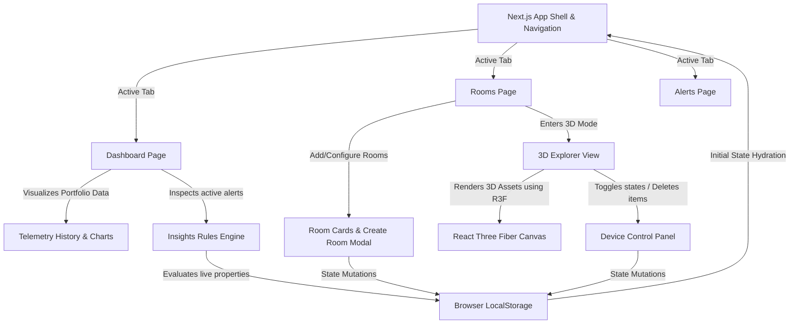
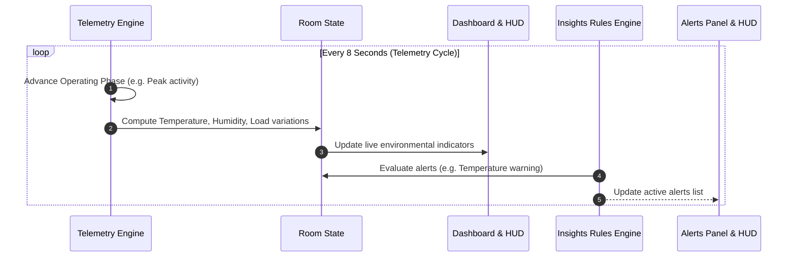
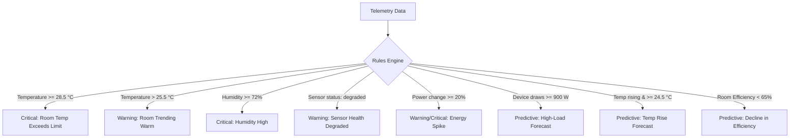

<div align="center">


# TwinSync
Browser-based Digital Twin Prototype for Smart-Room Monitoring & 3D Management


[](#)
[](#)
[](#)
[](#)
[](#)
[](#)
[](#)
[](#)

---
</div>

**TwinSync** is an advanced browser-based digital twin prototype for smart-room monitoring, 3D room design, device control, and simulated environmental telemetry.

It integrates a high-performance **Next.js Web Client** with a real-time **React Three Fiber (R3F) Canvas** to render and manage interactive 3D rooms, place dynamic electronic devices or furniture, and simulate ambient room telemetry. Data is seamlessly persisted to browser local storage and can be imported or exported as JSON configurations.

---

<br />

## 📌 Table of Contents
1. [Core Features](#-core-features)
2. [Project Architecture](#-project-architecture)
3. [Technology Stack](#-technology-stack)
4. [Domain Model & Schema Overview](#-domain-model--schema-overview)
5. [Simulated Telemetry & Operating Phases](#-simulated-telemetry--operating-phases)
6. [Smart Telemetry Insights & Alerts](#-smart-telemetry-insights--alerts)
7. [3D Room Canvas Control Guide](#-3d-room-canvas-control-guide)
8. [Setup & Local Deployment](#-setup--local-deployment)
9. [Validation & Verification](#-validation--verification)

<br />

---

<br />

## 🌟 Core Features

*   **Interactive Dashboard**: Real-time aggregated statistics (Total Rooms, Active Devices, Active Alerts, Current Portfolio Load), hottest room indicator, overall sensor health status, and live telemetry charts showing average temperature and power load.
*   **3D Room Explorer & Sandbox**: A first-person 3D environment built on React Three Fiber. Users can move around, look, and place/edit objects dynamically on a 1x1 meter snapping grid.
*   **Asset Library & Mount System**: Pre-built 3D models for furniture, structures, and electronic devices. Assets support different mounting constraints (`floor`, `wall`, or `ceiling`) and automatically snap to appropriate vertical heights:
    *   *Devices*: Wall/Ceiling Air Conditioners, Projectors, Ceiling Lights, Standalone Desktops, Printers.
    *   *Furniture*: Desks with Desktops, Small Tables, Long Tables, Office Chairs.
    *   *Structures*: Doors, Windows, Whiteboards.
*   **Device Control Panel**: Clicking a placed electronic device in the 3D room opens a panel to inspect its real-time diagnostics, toggle its status (`on` / `off`), monitor its power draw, and decommission it.
*   **Smart Telemetry Insights**: Simulated telemetry updates environmental conditions (temperature, humidity, occupancy, power consumption) every 8 seconds. Rule-based analytics trigger real-time critical warnings (such as overheating, high humidity, power spikes, or device faults) and predictive forecasting alerts (e.g. high-load operation warnings, room efficiency score warnings, or temperature rise predictions).
*   **Storage Management**: Supports importing and exporting entire room arrays as JSON configurations alongside automatic browser local storage persistence.

<br />

---

<br />

## 🏗 Project Architecture

TwinSync is built as a client-side digital twin dashboard and simulator:



*   **App Shell & State Router**: Next.js App Router structure, utilizing client-side hydration from local storage on load.
*   **React Three Fiber Canvas**: Manages 3D models, shadows, hemisphere lighting, grid placement calculations, and first-person player controls.
*   **Telemetry Simulator Loop**: Drives virtual sensor cycles, computing environmental shifts based on layout presets, device states, and occupancy schedules.

<br />

---

<br />

## 🛠 Technology Stack

*   **Framework**: Next.js 16.2.6 (App Router)
*   **Core Library**: React 19.2.4 & React DOM 19.2.4
*   **3D Graphics Engine**: Three.js 0.183.2
*   **React-3D Bindings**: React Three Fiber (`@react-three/fiber` 9.6.1) & Drei helper hooks (`@react-three/drei` 10.7.7)
*   **Styling**: Tailwind CSS v4 with `@tailwindcss/postcss` for theme declarations & modular CSS files (`.module.css` for isolation)
*   **Persistence**: HTML5 LocalStorage API
*   **Build Pipeline**: TypeScript 5 with ESLint 9 & Next compiler validation

<br />

---

<br />

## 📊 Domain Model & Schema Overview

Since TwinSync operates as a frontend-only digital twin prototype, the workspace is structured around specialized TypeScript interfaces representing physical layouts, telemetry, and smart indicators:

| Category | Interface Name | Key Attributes | Description |
| :--- | :--- | :--- | :--- |
| **Core Layouts** | `DigitalTwinRoom` | `id`, `name`, `width`, `length`, `height`, `layoutType`, `items` | Represents a 3D physical room space containing metadata and placed components. |
| | `PlacedItem` | `id`, `itemTypeId`, `name`, `position` (Vec3), `rotationY`, `status`, `powerWatt`, `alerts` | A specific device or furniture placed in 3D space with interactive settings. |
| | `ItemDefinition` | `id`, `label`, `category`, `mount`, `width`, `length`, `height`, `defaultPowerWatt`, `isDevice` | Structural template specifying size, default power, mount constraints, and 3D visual properties. |
| **Simulated Telemetry** | `RoomEnvironmentReading` | `roomId`, `roomName`, `temperatureC`, `humidityPercent`, `livePowerWatt`, `occupancyPercent`, `temperatureStatus`, `sensorStatus` | Dynamically calculated real-time environmental metrics updating on each telemetry cycle. |
| **Analytics & KPIs** | `RoomKpi` | `totalDevices`, `activeDevices`, `faultDevices`, `totalAlerts`, `estimatedPowerWatt`, `efficiencyScore` | Quantitative metrics evaluating power load and efficiency index (0-100%). |
| **Diagnostics** | `TwinSyncAlert` | `id`, `kind` (realtime / predictive), `severity` (critical / warning / info), `category`, `title`, `description` | Diagnostic incident logs generated by the rules engine evaluating room telemetry. |

<br />

---

<br />

## 🔄 Simulated Telemetry & Operating Phases

The simulated telemetry system updates room statistics dynamically every **8 seconds** (`TELEMETRY_INTERVAL_MS = 8000`). It calculates environmental shifts based on **8 distinct operating phases** and the layout profile of the room:



### 1. Operating Phases
The portfolio rotates through phases affecting load factors, ambient heat generation, and occupant count:
*   **Early startup** (Load Factor: `0.62`, Temp Delta: `-0.5°C`, Occupancy: `24%`)
*   **Arrival ramp** (Load Factor: `0.88`, Temp Delta: `+0.2°C`, Occupancy: `56%`)
*   **Peak activity** (Load Factor: `1.24`, Temp Delta: `+1.9°C`, Occupancy: `92%`)
*   **Cooling response** (Load Factor: `1.15`, Temp Delta: `+0.8°C`, Occupancy: `84%`)
*   **Stable operation** (Load Factor: `0.94`, Temp Delta: `0.0°C`, Occupancy: `68%`)
*   **Low activity** (Load Factor: `0.48`, Temp Delta: `-0.7°C`, Occupancy: `18%`)
*   **Thermal drift** (Load Factor: `1.08`, Temp Delta: `+3.5°C`, Occupancy: `76%`)
*   **Recovery** (Load Factor: `0.78`, Temp Delta: `+0.6°C`, Occupancy: `42%`)

### 2. Layout Environmental Baselines
Each room has baseline metrics depending on its layout type:
*   **Computer Lab**: Base Temp `25.1°C`, Base Humidity `53%`, Device Utilization `72%`
*   **Study Room**: Base Temp `23.6°C`, Base Humidity `50%`, Device Utilization `44%`
*   **Office**: Base Temp `24.2°C`, Base Humidity `48%`, Device Utilization `58%`
*   **Empty**: Base Temp `22.8°C`, Base Humidity `47%`, Device Utilization `12%`

### 3. Microenvironmental Factors
*   **Heat Mitigation**: If a room has air conditioning units placed and toggled `on`, the telemetry engine applies a direct `-1.4°C` cooling correction to the ambient temperature.
*   **Device Thermal Load**: Active devices raise ambient temperatures relative to the percentage of active vs. inactive equipment.
*   **Sensor Health**: On cycle intervals, certain sensor status indicators toggle to `degraded` to simulate physical hardware signal drops.

<br />

---

<br />

## 🔒 Smart Telemetry Insights & Alerts

The system implements a rules engine that analyses real-time and historical sensor telemetry to construct active diagnostics categorized as **Realtime** or **Predictive** alerts:



### Real-Time Alerts
*   **Device Status**: Faulted devices instantly raise a critical warning indicating they require manual reset/investigation.
*   **Ambient Temperature limits**: Critical alarms trigger if a room exceeds `28.5°C`. Warnings trigger between `25.5°C` and `28.5°C`.
*   **Humidity thresholds**: Alarms trigger if relative humidity rises above `65%` (Warning) or `72%` (Critical).
*   **Consumption Spikes**: If load consumption increases by `>=20%` (Warning) or `>=45%` (Critical) between cycles.
*   **Sensor Glitches**: Reports intermittent telemetry issues when sensor data degraded signals are detected.

### Predictive Alarms
*   **High-Load Forecast**: Triggered for devices consuming `>=900 W` (such as active cooling units), estimating power usage patterns for an 8-hour period.
*   **Temperature Rise Forecast**: Projects ambient temperature increments if trends are rising while rooms are warm.
*   **Efficiency Score Alert**: Triggered when a room's compound efficiency score (derived from active loads, alerts, and active faults) falls below `65%`.

<br />

---

<br />

## 🎮 3D Room Canvas Control Guide

The 3D sandbox explorer utilizes an immersive canvas. Follow this command sheet to interact:

| Input / Action | Controls / Keys | Description |
| :--- | :--- | :--- |
| **Activate Focus** | **Double Click** | Locks the cursor inside the canvas for first-person perspective. |
| **Release Focus** | **Escape Key** | Releases pointer lock and displays cursor overlay. |
| **Movement** | **W / A / S / D** | Walk forward, backward, left, and right within the room bounds. |
| **Looking** | **Mouse Drag / Rotate** | Look around the 3D space (requires pointer lock). |
| **Inventory / Bag** | **B Key** | Opens the inventory overlay to select and map items to your Hotbar. |
| **Hotbar Slots** | **Keys 1 - 9, 0** | Switch active placement item from the hotbar. |
| **Item Rotation** | **Hold Right-Click** | Rotates the placement preview grid-mesh prior to positioning. |
| **Place Item** | **Q Key** | Places the active hotbar item at the grid indicator (snaps to floor/wall/ceiling). |
| **Remove Hovered** | **E Key** | Instantly deletes the item you are currently looking at. |
| **Device Settings** | **Left-Click Device** | Open the control panel overlay for the selected active device. |

<br />

---

<br />

## 🚀 Setup & Local Deployment

### 1. Prerequisites
Ensure you have the following installed on your local machine:
*   **Node.js** (v18.x or v20.x recommended)
*   **npm** (comes packaged with Node.js)

### 2. Quickstart Installation
1.  Navigate into the `TwinSync` project directory:
    ```bash
    cd TwinSync
    ```
2.  Install dependencies:
    ```bash
    npm install
    ```
3.  Launch the local development server:
    ```bash
    npm run dev
    ```
4.  Open your browser and navigate to [http://localhost:3000](http://localhost:3000).

<br />

---

<br />

## 🧪 Validation & Verification

To verify that the project is correct and passes TypeScript compilation and lint validations, run the following checks locally:

```bash
# 1. Run ESLint rules validation
npm run lint

# 2. Run TypeScript strict build checks
npx tsc --noEmit

# 3. Compile the production Next.js bundle
npm run build
```
